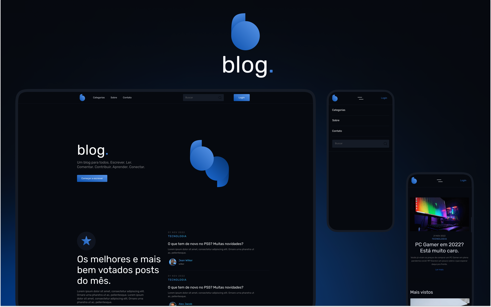

<h1 align="center"> Blog.</h1>

  <a href="#-projeto">Projeto</a>&nbsp;&nbsp;&nbsp;|&nbsp;&nbsp;&nbsp;
  <a href="#-tecnologias">Tecnologias</a>&nbsp;&nbsp;&nbsp;|&nbsp;&nbsp;&nbsp;
  <a href="#-layout">Layout</a>

 

  

## 💻 Projeto

O Blog é um projeto desenvolvido em React.js. A aplicação foi desenvolvida para demonstrar na prática uma SPA, consultas em API, React Hooks e demais conceitos de React.js. Foi utilizada uma biblioteca de responsividade em SASS para sua estrutura de layout.

## 🚀 Tecnologias

Esse projeto foi desenvolvido com as seguintes tecnologias:

&nbsp;

&nbsp; 
&nbsp;

&nbsp;  

## 🔖 Layout

Você pode visualizar o layout do projeto através [DESSE LINK](https://www.figma.com/file/fIU2cjAqWVDvtXO4hhbzFf/Blog?node-id=1%3A4&t=onSYFFMwd9ED9ROj-0). É necessário ter conta no [Figma](https://figma.com) para acessá-lo.

Interaja com o componente: [LINK](https://blog-project-react.netlify.app/).

---